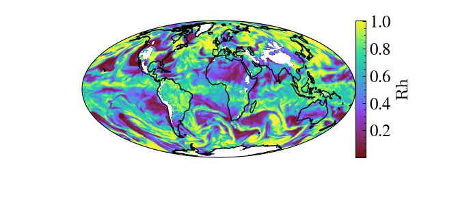
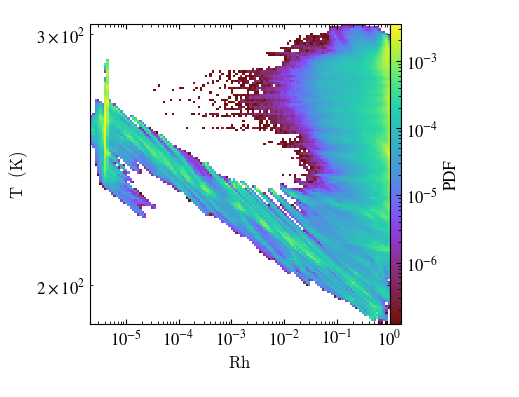

# Recent improvements to `yt`, `yt_xarray`


**yt_xarray: yt api access**: 

initial setup: silencing unrelated warnings and logs for brevity here. 


load the data. data is local file, data is from the MERRA-2 reanalysis dataset (hosted at 
[GES DISC](https://disc.gsfc.nasa.gov/datasets/M2I3NPASM_5.12.4/summary), NASA EarthData) 

```python
import yt_xarray
import cartopy.feature as cfeature

dsx = yt_xarray.open_dataset("sample_nc/MERRA2_100.inst3_3d_asm_Np.19800120.nc4")

dsx0 = dsx.isel({'time':0})
slc = dsx0.yt.SlicePlot('altitude', 'RH', center=(800, 0.,0.))
slc.set_log('RH', False)
slc.render()
slc.plots['RH'].axes.add_feature(cfeature.COASTLINE)
slc.show()
```



```python 
import xarray as xr
import numpy as np
ones_da = xr.DataArray(np.ones(dsx0.RH.shape), dims=dsx0.RH.dims)
dsx0['ones_field'] = ones_da

pp = dsx0.yt.PhasePlot('RH', 'T', 'ones_field', weight_field=None, fractional=True, figure_size=(3,3))
pp.set_colorbar_label('ones_field','PDF')
pp.set_font_size(12)
pp.show()
pp.save('slice_images/merra2_phase_plot.png')
```



