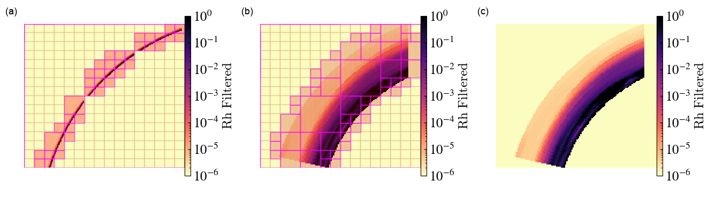

# Embedded Transformations within yt_xarray

In addition to providing methods for creating `yt` datasets that directly 
reference `xarray` datasets, ongoing development within `yt_xarray` 
([yt_xarray PR #75](https://github.com/data-exp-lab/yt_xarray/pull/75))
will provide a number of methods for building cartesian `yt` datasets with 
embedded transformations and interpolation of `xarray`
datasets defined in non-cartesian coordinates. This approach provides a convenient 
way of utilizing `yt` methods that rely on cartesian geometries without having to 
pre-interpolate data, making reproducible workflows to, for example, generate 
3D volume renderings much simpler to make.

The general workflow is

1. open the xarray dataset
2. define the transformation from the dataset's native coordinatees to cartesian coordinates   
3. define the method of interpolation
4. initialize the yt dataset 

5. In pseudo-code, the above steps look like:

```python
import yt_xarray 
from yt_xarray.transformations import GeocentricCartesian, build_interpolated_cartesian_ds

ds = yt_xarray.open_dataset(...) # or xr.open_dataset
gc = GeocentricCartesian(...)
ds_yt = build_interpolated_cartesian_ds(ds, gc, ...)  # a cartesian yt dataset
```

Initially, `build_interpolated_cartesian_ds` only sets up the cartesian grid (or grids) 
that will be used to wrap the non-cartesian geometry and actual interpolation of the 
data onto the cartesian grid (or grids) is delayed until `yt` needs the data. During 
initialization of the `yt` dataset (`build_interpolated_cartesian_ds`, step 4 above), 
the user can specify parameters that control how the cartesian grid is built. For 
example, the following pseudo-code:

```python
build_interpolated_cartesian_ds(
    ds, 
    gc, 
    grid_resolution=(16,16,16),    
    refine_grid=True,
    refine_by=8,
    refine_min_grid_size=2,    
   ...)
```

`grid_resolution` specifies the coarse grid resolution of 16 cells in each dimension. 
When `refine_grid` is `True`, `yt_xarray` will apply a recursive subdivision of 
the domain into a number of smaller grids: starting from the coarse grid, the domain is 
divided in half along each dimension and grid cells are filled with a binary image mask, 
where cell values are set to 1 if they fall within the bounds of the non-cartesian 
geometry. Division proceeds recursively, with empty grids being discarded, until the
remaining grids satisfy an adjustable fill criteria (or the max number of iterations
has been reached). In addition to the recursive bisection, one may use an implementation 
of **CITATION  (berger and rigoutsos 1991, https://doi.org/10.1109/21.120081)** 
by setting `refinement_method='signature_filter'`. 

In the following, two examples with real datasets are described, with images from 
sequential stages of the above transformation workflow along with a final 3D volume
rendering. The first example uses a seismic tomography model of the Earth's upper 
mantle beneath the Western U.S. **CITATION**, while the second uses a MERRA-2 netcdf file from **CITATION**. 

## Volume Rendering Workflow: Seismic Tomography


(a) The data is initially loaded with `xarray` in native coordinates which in this 
case is internal geodetic coordinates (depth beneath the Earth's surface, 
latitude and longitude). From here, all the usual `xarray` methods apply: the image
here is a slice at 100 km depth through shear wave speed anomalies (Dvs), 
generated in this case with `yt_xarray`'s convenience wrapper of `yt.SlicePlot` (see 
previous section). 

(b) After defining the transformation from geodetic coordinates to cartesian coordinates, 
a wrapping cartesian grid is refined to generate a cartesian `yt` dataset. This
cartesian dataset can be used with any `yt` method. A `yt.SlicePlot` with grid and cell 
annotations illustrates the refined grid structure: the squares outline in bold represent 
the edges of grids while fainter lines indicate grid cells. The starting grid here was 32x32x32
with a refinement factor of 8, resulting in a dense sampling where there is data in the 
underyling geometry. In constructing this plot, `yt` will access data only in the grids 
intersected by the desired cutting plane and grids are processed individually. This means that
only a subset of the full dataset is interpolated on-demand, as needed by yt.

(c) Once the cartesian `yt` dataset is available, methods in `yt` that rely on cartesian 
ray tracing are available to use. The image here is a 3D volume rendering of only the 
slow velocity anomalies (where Dvs is less than 0). The transfer function used here
consists of a number of gaussian samples of the data spaced linearlly between 0.1 and 
8 percent and results in a clear signal of the Yellowstone hot spot track beneath 
northeast Idaho and northwest Wymoing, where high temperatures and partially molten 
rock decrease the shear wave speed

In pseudo, code the above steps are


The full code is available at [code repository associated with these materials](https://github.com/data-exp-lab/yt_xarray_NASA_SMD_2024). 

## Volume Rendering Workflow: Atmospheric Geophysics, MERRA-2

The second example demonstrates some of the difficulty of volume rendering with 
geophysical data. In addition to having to interpolate to cartesian coordinates, 
the vertical length scale present in data

MERRA-2 example


(a) Data defined in (pressure level, latitude, longitude). Relative humidity 

(b) Transformation here: pressure level to height, apply a radial scale factor and then
convert to "virtual" cartesian coordinates. 

(c) The volume rendering here caputres the coherence of the high relative humidity 
features in 3D. Also, missing data is a challenge for volume rendering: set to 0.0 
and transfer function chosen to exclude those 0.0 values. 

The following image further illustrates the difficulty of volume rendering with short relative radial length
scales:



In panel (a), a cartesian grid is constructed from the raw data subsample, 
without applying any vertical exaggeration factor. Over the length scales required 
to capture features of interest (tens of degrees), the relative thickness of the
atmosphere is difficult to resolve (the grid refinement actually breaks down and misses
some points). Panels (b) and (c) demonstrate the same data with a radial scale factor of 20., 
resulting in a virtual cartesian grid that can reasonably resolve features within the 
atmosphere.