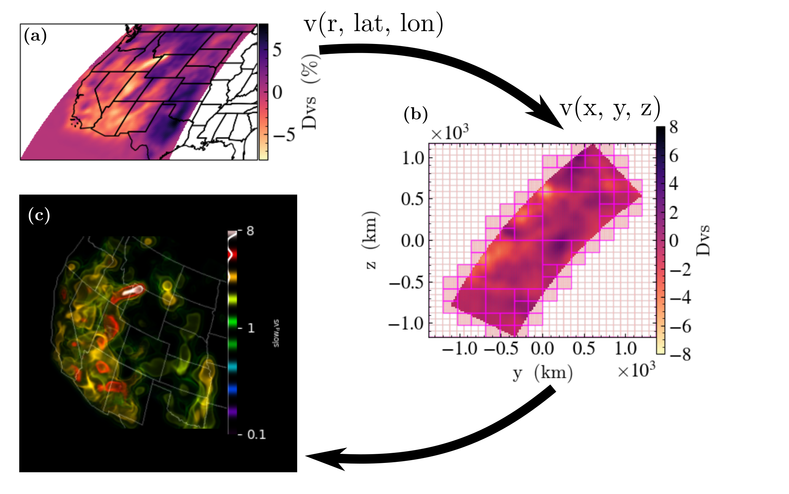
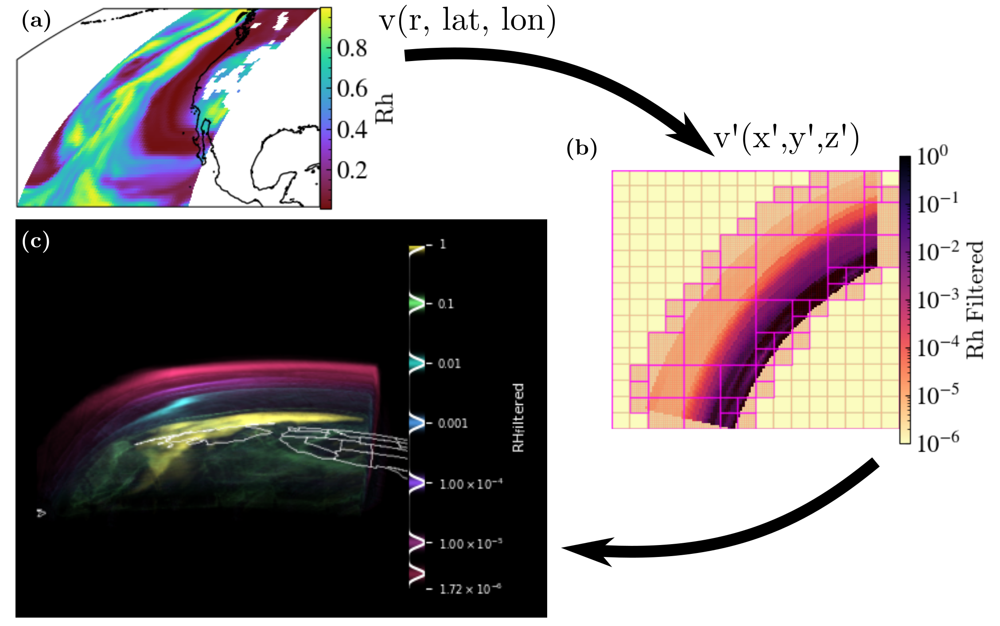

# Embedded Transformations within yt_xarray

In addition to providing methods for creating `yt` datasets that directly 
reference `xarray` datasets, `yt_xarray` provides a number of methods for building
cartesian `yt` datasets with embedded transformations and interpolation of `xarray`
datasets defined in non-cartesian coordinates. This approach provides a convenient 
way of accessing `yt` methods that rely on cartesian geometries without having to 
pre-interpolate data, which would otherwise be necessary to use `yt`'s volume 
rendering capabilities, which relies on cartesian ray tracing for 3D projections. 

The general workflow is

1. open the xarray dataset
2. define the transformation from the dataset's native coordinatees to cartesian coordinates   
3. define the method of interpolation
4. initialize the yt dataset 

Just as in the `yt` datasets generated from `xarray` datasets, the actual evaluation of 
data is delayed until the point at which `yt` actually needs the data. During 
initialization of the `yt` dataset (step 4 above), the user can opt to apply grid 
refinement methods in order to avoid oversampling sparse regions that result from 
bounding a curvilinear geometry by a cartesian box. 

In pseudo-code, the above steps look like:


```
import yt_xarray 
from yt_xarray.transformations import GeocentricCartesian

ds = yt_xarray.open_dataset(...) # or xr.open_dataset
gc = GeocentricCartesian(...)
```


Example of yt_xarray workflow for volume rendering 



For non-mantle geophysics, common to have thin-layers. 

MERRA-2 example

